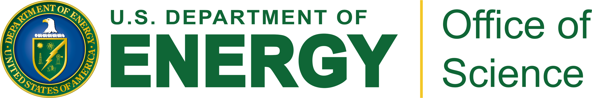

# JAM3DLIB

## List of Fits

|Reference        |   tag    |   Data Included  |   Functions Extracted       |
|-----------------|----------|------------------|-----------------------------|
|arXiv:2002.08384 |JAM3D_2020|SIDIS, SIA, DY, pp|Sivers, transversity, Collins|


## Installation

### clone the repos

 ```git clone  git@github.com:QCDHUB/jam3dlib.git```

 ```git clone  git@github.com:QCDHUB/jam3d.git```

### prepare a python2 environment 

- Download and install anaconda3 (python 3.7) into your system from https://www.anaconda.com/distribution/

- Create and activate python2 enviroment

  ```conda create -n python2 python=2.7 anaconda```
  
  ```conda activate python2```

- Install subprocess32

  ```conda install subprocess32```

- Install all the dependencies

  ```pip install -r dependencies```


## Getting started

- Change into the jam3d directory 

  ```cd jam3d```

- Source the setup

  ```source setup.bash```

- Changed into the jam3dlib directory

  ```cd ../jam3dlib```

- We have provided two files in the jam3dlib repo with simple
examples to evaluate the TMD and CT3 PDFs/FFs and asymmetries

   - example.ipynb: detailed example jupyter notebook

     ```jupyter notebook example.ipynb```

   - example.py: bare-bones template python file

     ```python example.py```


## Authors (Please contact Daniel, Alexei, or Nobuo with questions)

- Justin Cammarota

- Leonard Gamberg

- Zhong-Bo Kang

- Joshua A. Miller

- Daniel Pitonyak (pitonyak@lvc.edu)

- Alexei Prokudin (prokudin@jlab.org)

- Ted C. Rogers

- Nobuo Sato (nsato@jlab.org)


## Institutions



